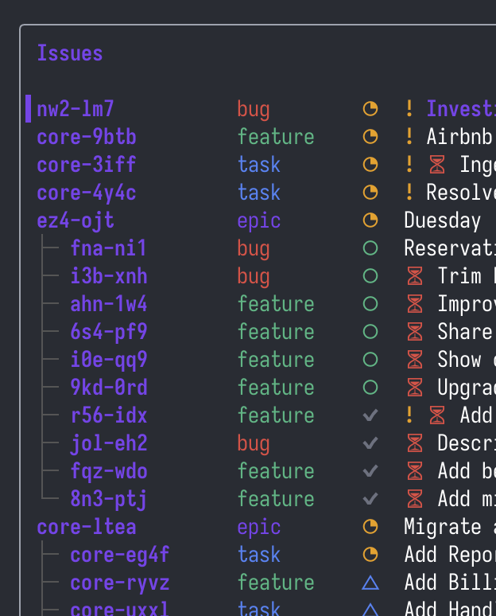

# Toba TODO

This is derived from [hmans/beans](https://github.com/hmans/beans) which was in turn inspired by [steveyegge/beads](https://github.com/steveyegge/beads). (I apologize for not coming up with another rhyming *b* name.)

## why

Like the others, this is a git-diffable **issue tracker** that lives in your project. *Unlike the others* (last I checked), it has options to synchronize with popular issue trackers that regular people sometimes look at, and some small features I was too impatient to wait for.

That's why I made yet another thing. The reason for such tooling at all is to encourage (and what more can we really do?) your LLM agent to track its work more reliably and token-efficiently.

## what's different

Everything in [beans](https://github.com/hmans/beans), plus:

- **External sync**: bidirectional sync with ClickUp and GitHub Issues (`todo sync`)
- **Due dates**: date field with sort support
- **TUI improvements**
    - Status icons instead of text labels
    - Sort picker (`o` key)
    - Substring search instead of fuzzy match
    - Tap `/` twice to search descriptions too
    - Due date indicators




## Installation

Either download todo from the [Releases section](https://github.com/toba/todo/releases), or install it via Homebrew:

```bash
brew install toba/todo/todo
```

Alternatively, install directly via Go:

```bash
go install github.com/toba/todo@latest
```

## Configure Your Project

Inside the root directory of your project, run:

```bash
todo init
```

This creates a `.issues/` directory and a `.toba.yaml` configuration file at the project root. Both are meant to be tracked in version control.

### Sample Configuration

```yaml
# .toba.yaml
todo:
  issues:
    path: .issues
    editor: "code --wait"
```

## Agent Configuration

The most basic way to teach your agent about todo is to add the following instruction to your `AGENTS.md`, `CLAUDE.md`, or equivalent file:

```
**IMPORTANT**: before you do anything else, run the `todo prime` command and heed its output.
```

The `prime` output is designed to be token-efficient — about 680 words of rendered output — so it doesn't eat your context window alive every time a session starts or compacts.

### Claude Code

Add the following hooks to your project's `.claude/settings.json` file:

```json
{
  "hooks": {
    "SessionStart": [
      { "hooks": [{ "type": "command", "command": "todo prime" }] }
    ],
    "PreCompact": [
      { "hooks": [{ "type": "command", "command": "todo prime" }] }
    ]
  }
}
```

## Usage

```bash
todo help          # List all commands
todo tui           # Interactive terminal UI
todo list          # List all issues
todo create "Fix login bug" -t bug -s ready
todo show abc-def  # View an issue
todo sync          # Sync to ClickUp or GitHub Issues
```

### Agent Workflows

The real power of todo comes from letting your coding agent manage tasks. Assuming you have integrated todo into your agent, you can use natural language:

```
Are there any tasks we should be tracking for this project? If so, please create issues for them.
```

```
What should we work on next?
```

```
It's time to tackle abc-def.
```

```
Please inspect this project's issues and reorganize them into epics and milestones.
```

## Syncing with External Trackers

todo syncs issues bidirectionally with **ClickUp** and **GitHub Issues**. Configure the integration in `.toba.yaml` under `todo.sync`, then run:

```bash
todo sync                  # Sync all issues
todo sync abc-def xyz-123  # Sync specific issues
todo sync --dry-run        # Preview changes without applying
todo sync --force          # Force update even if unchanged
```

Per-issue sync state is stored in frontmatter:

```yaml
---
title: Fix login bug
status: ready
sync:
  clickup:
    task_id: "868h4hd05"
    synced_at: "2026-01-18T00:07:02Z"
  github:
    issue_number: "42"
    synced_at: "2026-01-18T00:07:02Z"
---
```

Sync data is readable and writable via the GraphQL API:

```graphql
# Read sync data
{ issue(id: "abc-def") { sync { name data } } }

# Write sync data
mutation { setSyncData(id: "abc-def", name: "clickup", data: { task_id: "xyz" }) { id } }

# Filter by sync
{ issues(filter: { hasSync: "clickup" }) { id title } }
{ issues(filter: { syncStale: "clickup" }) { id title } }
```

### ClickUp

Requires `CLICKUP_TOKEN` environment variable. Syncs statuses, priorities, types, and blocking relationships as ClickUp task dependencies.

```yaml
todo:
  sync:
    clickup:
      list_id: "123456789"           # Required
      assignee: 42                    # Optional: default assignee
      status_mapping:
        draft: "backlog"
        ready: "to do"
        in-progress: "in progress"
        completed: "complete"
        scrapped: "closed"
      priority_mapping:               # ClickUp: 1=Urgent, 2=High, 3=Normal, 4=Low
        critical: 1
        high: 2
        normal: 3
        low: 4
      custom_fields:
        issue_id: "cf-field-uuid"
        created_at: "cf-field-uuid"
        updated_at: "cf-field-uuid"
      sync_filter:
        exclude_status:
          - completed
          - scrapped
```

### GitHub Issues

Requires `GITHUB_TOKEN` environment variable. Maps statuses, priorities, and types to GitHub labels (e.g., `status:in-progress`, `priority:high`, `type:bug`). Blocking relationships are rendered as text in the issue body.

```yaml
todo:
  sync:
    github:
      repo: "owner/repo"   # Required
```

## License

This project is licensed under the Apache-2.0 License. See the [LICENSE](LICENSE) file for details.
